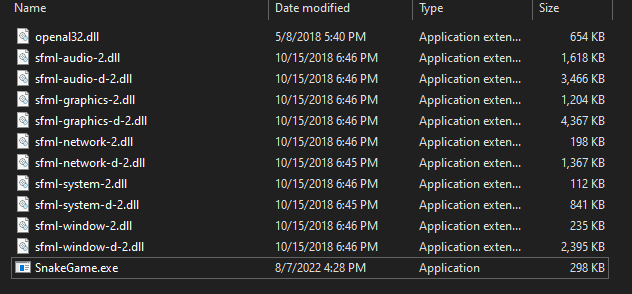

# SnakeCpp

SnakeCpp is a cross-platform game where you control a snake that eats fruits and challenge yourself. See more [here](https://en.wikipedia.org/wiki/Snake_(video_game_genre)).

## Download

See https://github.com/ThiaudioTT/SnakeCpp/releases.

<hr>

## Requirements

[SFML](https://www.sfml-dev.org/download.php)

## Installation from source

In case you want to compile from source:

### On linux

Linux is much easier, open the folder with the terminal and type:

```make```

and execute ```SnakeGame.o```

Make sure that you have the dependencies like sfml and make:

On debian-based distros:

``` 
sudo apt-get install libsfml-dev
```

```
sudo apt-get install build-essential
```

### On windows

In windows is more harder.

1. Install sfml according to your compiler and put the files in /include directory.

2. Install your compiler and use the `make` to compile the files, use `windows` as an argument.

Example using [mingw](https://www.mingw-w64.org/) (The common option):

```dotnetcli
mingw32-make.exe windows
```


then, copy SnakeGame.exe to a folder and add the binaries of SFML in that folder, then your game is ready to be played.

Your folder will be like this:

